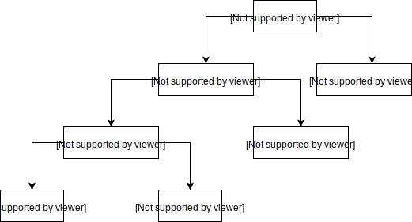
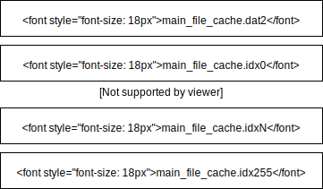

# Jagex Store 5
[](https://github.com/guthix/Jagex-Store-5/actions?workflow=Build)
[](https://github.com/guthix/Jagex-Store-5/blob/master/LICENSE)
[](https://openjdk.java.net/projects/jdk/11/)
[](https://discord.gg/AFyGxNp)

A library for reading, writing and transferring Jagex Store 5 (JS5) game files. 
Jagex Store 5 is a protocol used for storing game assets in the Runetek game engine made by the
Jagex Games Studio. A set of game assets is also called a cache and can
contain all type of game information like client scripts, models, 
animations, sounds etc. This library allows reading and writing the 
domain encoded file data from and to the cache.

## Cache Structure
The internal cache structure is different than how it is organized on disk.
A cache contains a set of archives which represent a single type of game asset.
Each archive contains a set of groups. A group, as the name suggest is a group of 1 or 
more files. Game assets are read and written from and to the cache on a group basis. 
It is thus not possible to read a single file from the cache. When you want to
access a file you have to read the whole group. Each archive, group and file has
an unique id in their own scope. So every group belonging to a single archive has
an unique id and every file in a single group has an unique id. Groups can also have names
which are stored as hashes in the settings.



### Disk Structure
A JS5 cache is made out of multiple files on disk. Each cache at least
1 data file (.dat2 extension), 1 master index (.idx255 extension) and multiple
archive index files (.idx0 until .idx254 extension). The index files contain
indexes which serve as pointers to data in the data file. The master index file
is a special type of index file which contains pointers to various archive 
meta-data, also stored in the data file. Every index in the master index file points
to meta-data from a different archive.



Every index file other than the master index file represents a single archive.
Every index points to a different set of data. For the archive files this is the
group data and for the master index files this is the archive settings data.
The data read from the .dat2 file can be decompressed an decrypted. The resulting
data is what we call a container. The container can than be decoded into a group or
archive settings. Containers can optionally have versions stored with them. This is
used to check whether a container needs to be updated when updating the cache to a 
newer version.

## Usage
The Guthix JS5 library provides an API for reading and writing to the cache in an
efficient way. The `Js5DiskStore` provides an API for reading and writing the raw data 
from the cache from disk without doing any decoding or encoding. The `Js5SocketReader`
provides the same raw data access but it can be used to read data from a JS5 server.
The raw data is not really useful for most use cases. The `Js5Cache` provides a 
higher level cache overview that handles all the encoding, encryption, compression.

### Gradle
```Kotlin
implementation(group = "io.guthix", name = "jagex-store-5", version = "0.4.0")
```

### Examples
Below are some small examples for common cache operations. More advanced cache operations 
using the `Js5lDiskStore` and the `Js5SocketReader` can be found in the toolbox.

##### Opening a cache:
```kotlin
Js5DiskStore.open(Path.of("ROOT_CACHE_PATH")).use { ds ->
    val cache = Js5Cache(ds)
}
```

##### Reading a group by id
```kotlin
val archive0 = cache.readArchive(archiveId = 0)
val group0 = archive0.readGroup(groupId = 0)
```

##### Reading a group by name
```kotlin
val group0 = archive0.readGroup(groupName = "GROUP_NAME")
```

##### Modifying files in a group
```kotlin
group.files[0] = Js5File(id = 0, nameHash = "FILE_NAME".hashCode(), data = NEW_DATA)
```

##### Writing a group
Before writing a group it is recommended to also increase the group version.
```kotlin
group.version++
```
If you don't update the group version a client won't know that a new version of your asset is available.
```kotlin
archive0.writeGroup(group0, appendVersion = true)
cache.writeArchive(archive0)
```

##### Removing a group
```kotlin
archive0.removeGroup(group0.id)
cache.writeArchive(archive0)
```

After updating the cache like doing a removal operation it is required to also write the archive back to the cache. This
updates the meta-data attached to the group in the archive settings.

## Group and file names
The names of groups and files are stored as hashes. This makes it so 
they can't be retrieved from the cache. To retrieve a file by name you 
therefore need to know its name. Names can by found by performing 
dictionary attacks, rainbow table attacks to crack the hashes.

## Toolbox
Besides an API for modifying the JS5 cache this repository also provides a toolset
with useful tools for modifying, retrieving, optimizing and validating the cache.