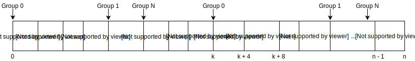

# Archives

Archives are part of a dictionary. A dictionary can have multiple 
archives. Each archive can have multiple files inside of it. Every 
archive has an unique identifier. Every file inside the same archive also
has an unique identifier. These identifiers don't have to be sequential.
Archives are retrieved by reading a container from the cache and decode 
the data from the container into an archive.

Archives can optionally also have a name. Files in an archive can also
have names. When the archive has a name all files inside of that archive
must also have names. The use of names is that files and archives can be
retrieved from the cache by their name without knowing the id. The names
are stored as hashes in the dictionary attributes. It is thus not possible
to retrieve those names without knowing them. Dictionary attacks can be
used to find archive an file names.

Besides the name hash the archives also stores some other data in the
dictionary attributes like crc, a whirlpool hash, some other unknown hash,
the compressed and uncompressed data sizes and a version. This version
is not the same as the version the container version which it got decoded
from.

Archive encoding is done in 2 different ways. In a lot of games there are
cases where in some of the dictionaries every archive has exactly 1 file
in it. If that's the case the container data will become the file data.
If the archive however contains multiple files the encoding becomes a 
little bit more complicated.

The file data can optionally be split in groups. When the files are split
into groups the file data is divided in N equal parts where N is the amount
of groups. The data is scattered over the groups. The groups store the
files sequentially and the groups themselves are also stored sequentially.

After the data is stored the group sizes are stored. For every group the
first stored size is the data size of the file inside that particular group, 
for all next sizes the difference is stored between the current and the previous
file size.

At the end, the amount of groups is stored. The reasons for using the group
system is unknown. Groups should be used however when the file size or
delta is bigger than 2147483647 bytes which is roughly 2 Gigabytes.