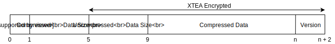

# Containers

Containers are optionally encrypted and optionally compressed 
blocks of data. Containers are the smallest possible unit 
which can be read and written to the cache. The data can either 
represent a group (loaded from archive indexes) or archive 
settings (loaded from the master index).

The first byte in a container is the the compression type opcode. The opcode
represents what compression is used to compress the data. There are 4 possible
compression types supported:

| Opcode | Compression |
|--------|-------------|
| 0      | None        |
| 1      | BZIP2       |
| 2      | GZIP        |
| 3      | LZMA        |

After that the container encodes the size of the compressed data. The
rest of the container except for the version is (optionally) 
encrypted using an XTEA block cipher. An XTEA key (128 bit key) is required
to decipher the uncompressed size and compressed data. The end of the container
can also have a version attached. This version is optional and also not
send when transferring a cache over a network. The version is appended by the client.
The client uses this version to verify if the container is out of date by 
comparing it with the version in the group settings. The containers that contain
settings files thus can never have versions attached.