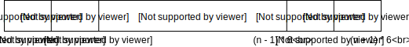
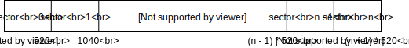
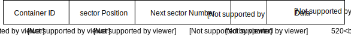
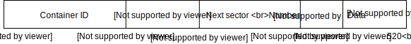

# File Store

The file store describes how the archives an files are stored on disk.
The structure of the files on disk looks as follows: 

A cache should always have at least 1 data file(.dat2), 1 attributes 
file(.idx255) and 1 dictionary(.idxi) file. There can be multiple 
dictionary files in one cache. Each dictionary file represents a type of
data. Examples of data types are models, compiled scripts, configuration
data, songs. The amount of dictionaries in a cache depends on the game.
Dictionary files should always be sequential and can go from .idx0 up to
.idx254. It is thus not possible to have an .idx0 file and an .idx2 file
without an .idx1 file.

When looking at the size of the cache you might notice that the .idx 
files are really small. This is because all cache data is stored in the
data file. The dictionary and attributes files just contain references
to the data stored in the data file. Every .idx file including the 
attributes file contains a list of pointers which points to locations
in the data file.

## Index files

Index files contain pointers to data in the data files. Both dictionary
files and attributes files are considered index files. Index files have
the .idxi file extension where is the a number ranging from 0 up to 255.
Index files have the following structure:

An index file contains a list of indexes. Each index represents a pointer
to container data in the data file. For dictionary index files an index
points to an archive. For attribute index file s an index points to 
dictionary attribute data. An index contains the data size of the container
and the first segment that it should start reading from the data file.
It looks as follows:

## Data file

The data file is where the actual cache data is stored. The data file is
a list of segments. Segments are of fixed size and multiple segments can
represent a file. A data file has the following structure:

Segments are made out of 2 parts. The segment header and the data part.
The segment header contains the id of the index file it belongs to
(the file extension number), the next segment which belongs to the same
container, its position in the list of segments belonging to that 
container and the container id it belongs to.

The container id, segment position and index file id are used for
verification while reading. The next segment position is for knowing where
the next segment of that container is. This means that segments don't have
to be stored sequentially in the data file.

A segment is encoded as follows:

This segment encoding however can only store segments with a container ids
up until 65535 (maximum unsigned short). So container with higher ids are 
stored with extended segments which look as follows:

