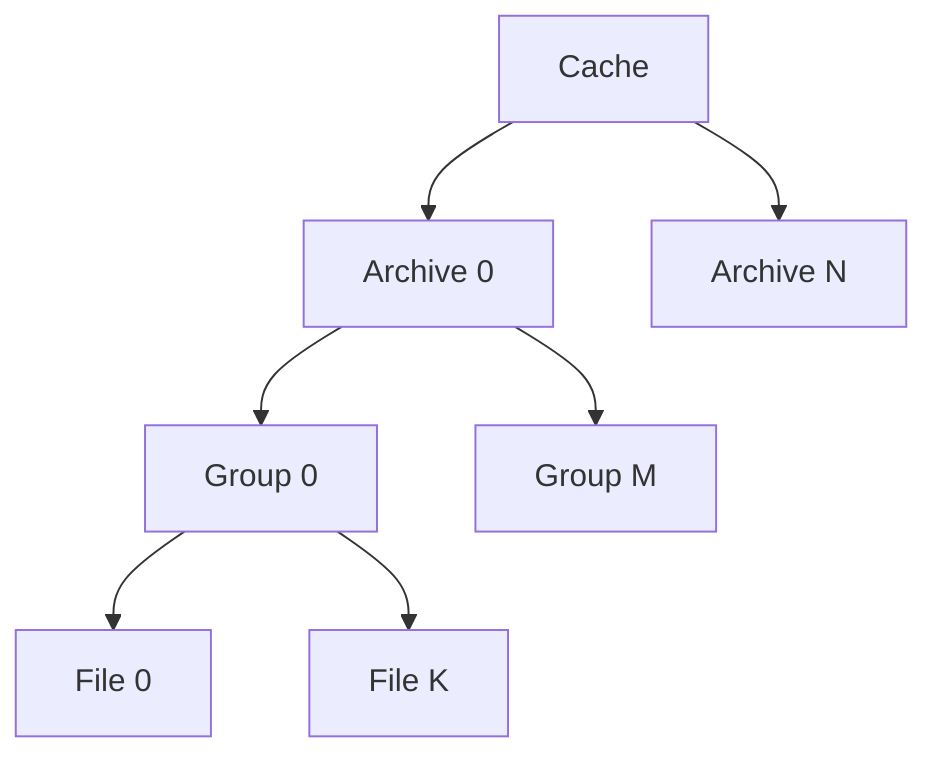
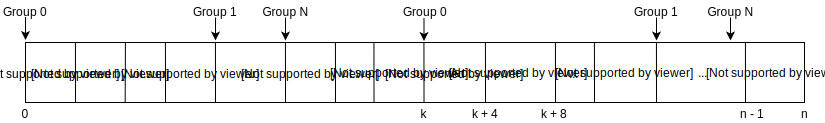

# Groups and Files

Groups are part of an archive. An archive can have multiple 
Groups. Each Group can have multiple files inside. Every 
Group has an unique identifier. Every file inside the same Group also
has an unique identifier. These identifiers don't have to be sequential.
Groups are retrieved by reading a container from the cache and decode 
the data from the container into an Group.

Groups can optionally also have a name. Files in an Group can also
have names. When the Group has a name all files inside of that Group
must also have names. The use of names is that files and Groups can be
retrieved from the cache by their name without knowing the id. The names
are stored as hashes in the archive settings. It is thus not possible
to retrieve those names without knowing them. Dictionary attacks can be
used to find group an file names.

Besides the name hash the Groups also stores other data in the
archive settings like crc, a whirlpool hash, some other unknown hash,
the compressed and uncompressed data sizes and a version.

Group encoding is done in 2 different ways. In a lot of games there are
cases where in some of the archives every Group has exactly 1 file
in it. If that's the case the container data will become the file data.
If the Group however contains multiple files the encoding becomes a 
little bit more complicated.

The file data can optionally be split in chunks. When the files are split
into chunks the file data is divided in N equal parts where N is the amount
of groups. The data is scattered over the groups. The groups store the
files sequentially and the groups themselves are also stored sequentially.
After the data is stored the group sizes are stored. For every group the
first stored size is the data size of the file inside that particular group, 
for all next sizes the difference is stored between the current and the previous
file size. At the end, the amount of groups is stored.

Groups are decoded from containers. If you want to read a file from the cache you
thus have to read the whole group. Grouping files together in a single group
reduces the amount of crc and version checking that needs to be done. It also reduces
the amount of meta-data storage overhead. It thus depend on the application if you want
to put multiple files into one group. If the files are often used together it is
recommended to put them in the same group.